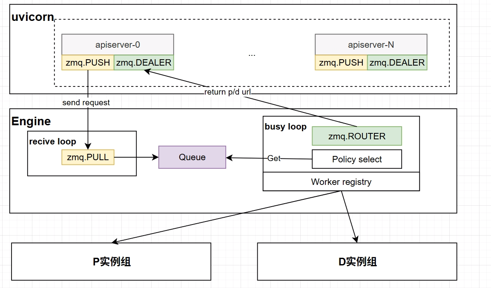

Smart Router



## Usage

Start the router service:

```bash
python -m smart_router serve --prefill-urls http://127.0.0.1:8100 --decode-urls http://127.0.0.1:8200
```

Run the integrated benchmark entrypoint:

```bash
python -m smart_router benchmark --input-file conversations.json --model /path/to/model --url http://127.0.0.1:8000
```

# RoadMap

- SGLang support
- Service discovery
- vllm kv event report 
- batch schedule
- prompt bin packing policy
